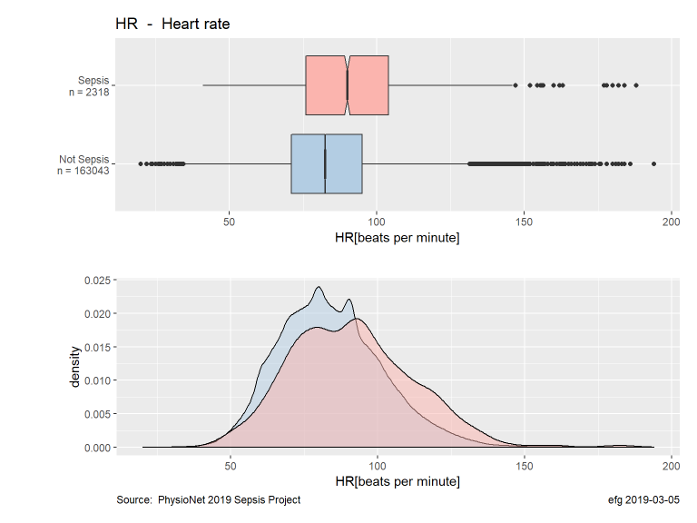
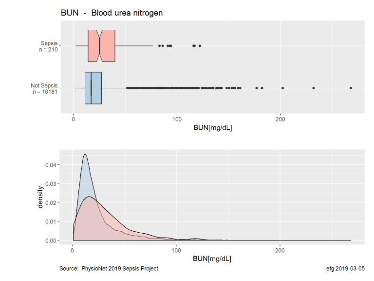
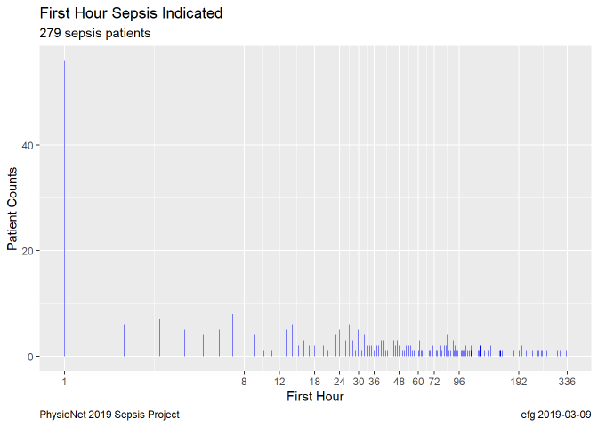

# PhysioNet 2019 Sepsis Challenge

Files related to
[Early Prediction of Sepsis from Clinical Data: the PhysioNet/Computing in Cardiology Challenge 2019](https://physionet.org/challenge/2019/).

**Vital Sign**

**Laboratory Value**

**Demographics**

Only about 1.4% of raw records indicate sepsis.  [2623 / 188453]

Only about 5.6% of the patients have sepsis.  [279 / 5000]

Sepsis reported in first hour for 20.1% of sepsis patients. [56 / 279]

