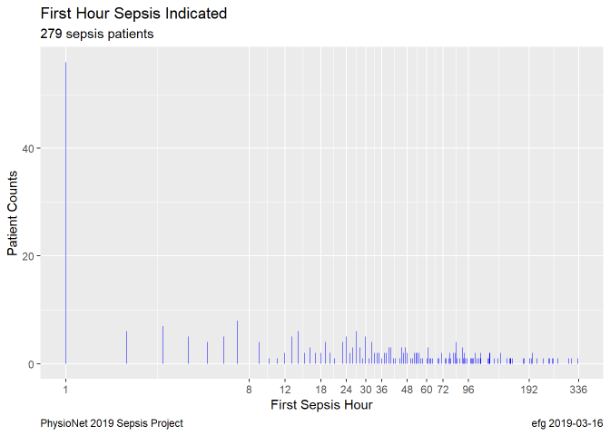

# PhysioNet 2019 Sepsis Challenge

Files related to
[Early Prediction of Sepsis from Clinical Data: the PhysioNet/Computing in Cardiology Challenge 2019](https://physionet.org/challenge/2019/).

When combined into a single dataset, the 5000 files contain 188,453 records with 42 fields.

**Missingness**

Fields always present: ICULOS, Age, Gender, HospAdmTime, SepsisLabel

Fields with < 15% missing values: HR, O2Sat, SBP, MAP, DBP

Fields with 20% to 90% missing: Temp, Resp, Glucose, Unit1, Unit2

All other fields have > 90% missing values.

The median patient percent missing is 100% for 16 of the quantities.

**Demographics**

Only about 1.4% of raw records indicate sepsis.  [2623 / 188,453]

Only about 5.6% of the patients have sepsis.  [279 / 5000]

Sepsis reported in first hour for 20.1% of sepsis patients. [56 / 279]

**Vital Signs**

**Laboratory Value**

